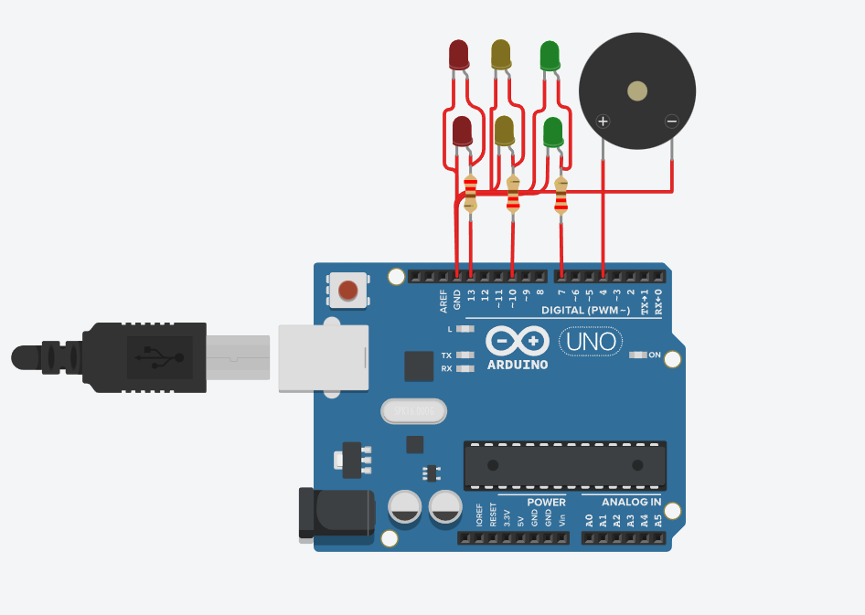

# Ejemplo Documentación Dojos

## Integrantes 
- Ariel Zubrzycki , Gonzalo Rojas, Micaela Robledo, Facundo Villoldo, Martin Uriche.

## Proyecto: Contador binario.

## Descripción
El gobierno de la ciudad quiere actualizar los semáforos que tiene instalados. La empresa  “UTNFRA Robotics” ganó la licitación y ahora les toca a los desarrolladores de la empresa generar un proyecto low cost que cumpla con las especificaciones que el gobierno de la ciudad nos  impone, a saber las especificaciones son las siguientes

## Función principal
1- El semáforo tiene que tener 2 leds de cada color como mínimo, en caso de que uno se  rompa. 
2- Tiene que implementar los tiempos correctos como se detallan a continuación. 3- El verde dura 5 segundos. 
4- El amarillo dura 3 segundos. 
5- Rojo dura 5 segundos. 
6- Tiene que tener señalización para personas no videntes como se detalla a  continuación. (Buzzer o piezo)
7- Durante el rojo: Tiene que sonar 2 vez por segundo en un tono FUERTE. 

~~~ C++ (lenguaje en el que esta escrito)
#define pin_rojo 13
#define pin_amarillo 10
#define pin_verde 7

int tiempoLedRojo = 0;

void setup()
{
  Serial.begin(9600);
  pinMode(pin_rojo, OUTPUT);
  pinMode(pin_amarillo, OUTPUT);
  pinMode(pin_verde, OUTPUT);
  pinMode(4, OUTPUT);
}

void loop()
{
  digitalWrite(pin_rojo, HIGH);

  while(tiempoLedRojo < 5)
  {
    if(digitalRead(pin_rojo) == HIGH)
    {
      tone(4, 500, 100);
      delay(500);
      tone(4, 500, 100);
    }
    delay(1000);
    tiempoLedRojo++;
  }
  digitalWrite(pin_rojo, LOW);
  
  digitalWrite(pin_amarillo, 1);
  delay(3000);
  digitalWrite(pin_amarillo, 0);
 
  digitalWrite(pin_verde, HIGH);
  delay(5000);
  digitalWrite(pin_verde, LOW);
}
~~~

## :robot: Link al proyecto
- [proyecto](https://www.tinkercad.com/things/7M1269KriUt-ariel-zubrzycki-ej-dojo-1-1/editel?sharecode=4OI8WmR8dBp7VtJk7ZIUEZbNc8AVt-eFlCY7BWc9wr8)

---
### Fuentes
- [Consejos para documentar](https://www.sohamkamani.com/how-to-write-good-documentation/#architecture-documentation).

- [Palabra reservada "Tone"](https://www.arduino.cc/reference/en/language/functions/advanced-io/tone/).

- [Lenguaje Markdown](https://markdown.es/sintaxis-markdown/#linkauto).

- [Markdown Cheatsheet](https://github.com/adam-p/markdown-here/wiki/Markdown-Cheatsheet).

- [Tutorial](https://www.youtube.com/watch?v=oxaH9CFpeEE).

- [Emojis](https://gist.github.com/rxaviers/7360908).

---

